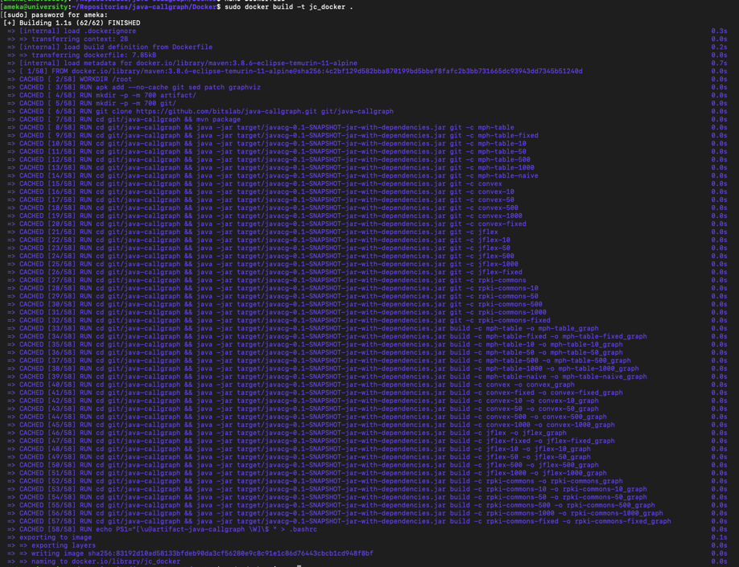
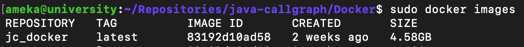
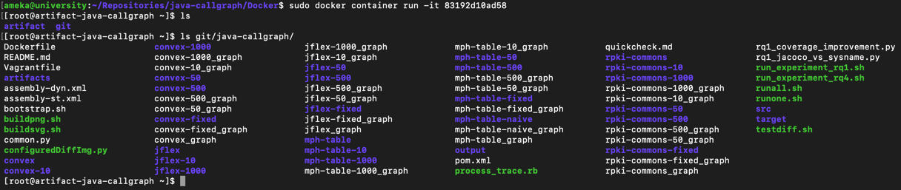

# Docker Instructions

## Setup Instructions
1. Build Docker Image

`sudo docker build -t jc_docker .`

2. Validate image creation, obtain IMAGE ID

`sudo docker images`

3. Interactively run container as root user

`sudo docker container run -it 83192d10ad58`

All vanilla and fixed versions of the projects will reside inside the "git/java-callgraph" folder.

## Experiment Instructions
