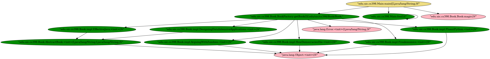

java-callgraph: Java Call Graph Utilities
=========================================

A program for generating static call graphs in Java.

* javacg-static: Reads classes from a jar file, walks down the method bodies and
   stores a table of caller-caller relationships.

#### Compile

The java-callgraph package is build with maven. Install maven and do:

```
mvn install -DskipTests
```

This will produce a `target` directory with the following jars:
- `javacg-0.1-SNAPSHOT.jar`: This is the standard maven packaged jar with static and dynamic call graph generator classes
- `javacg-0.1-SNAPSHOT-static.jar`: This is an executable jar which includes the static call graph generator
- `javacg-0.1-SNAPSHOT-dycg-agent.jar`: This is an executable jar which includes the dynamic call graph generator
- `javacg-0.1-SNAPSHOT-jar-with-dependencies.jar`: This is an executable jar which includes the static call graph generator and all dependencies needed to run this program

We're interested in the last jar, `javacg-0.1-SNAPSHOT-jar-with-dependencies.jar`, to analyze programs.

#### Run

Instructions for running the Static callgraph generator

`javacg` accepts arguments to specify behavior
- `jarPath` You can provide one or more paths to JAR files for analysis
- `entryPoint` has the form: `class1:<method1>(arg_types)`  
  -- i.e., `wcygan_test_Main:main(java_lang_String[])`
- `depth` specifies how far into the graph you would like to explore from the `entryPoint`
- `name` specifies that you would like to write the graph to a .dot file with name `name`

```
java -jar ./target/javacg-0.1-SNAPSHOT-jar-with-dependencies.jar -j <PATH_TO_JAR_1> -j <PATH_TO_JAR_N> -e <entryPoint> -d <depth> -o <name>
```

`javacg-static` produces combined output in the following format:

###### For methods

```
  class1:<method1>(arg_types) -> class2:<method2>(arg_types)
```

The line means that `method1` of `class1` called `method2` of `class2`.

For `invokedynamic` calls, it is not possible to infer the argument types.


#### Example

You can test this program by running the following code in the root directory:

```
java -jar ./target/javacg-0.1-SNAPSHOT-jar-with-dependencies.jar -j
./ExampleData/java-callgraph-driver-1.0-SNAPSHOT.jar -c ./ExampleData/jacoco.xml -o example  -e "edu.uic.cs398.Main:main(java.lang.String[])" -d 4
```

In the `output` folder you should see files `example-reachability-4.dot` and `example.dot`. You can use [Graphviz](https://www.graphviz.org/download/) to visualize these files. An example image is provided at `java-callgraph/ExampleData/example-reachability-4.png` (see below).



#### Known Restrictions

* The static call graph generator does not account for methods invoked via
  reflection.

#### Author

Georgios Gousios <gousiosg@gmail.com>  
Will Cygan <wcygan2@uic.edu>

#### License

[2-clause BSD](http://www.opensource.org/licenses/bsd-license.php)
