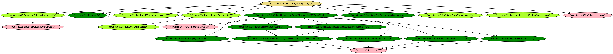

# java-callgraph

Static Call Graph Generator for Java Projects



## Table of Contents

- **[Build and Run](#build-and-run)**<br>
- **[Usage](#usage)**<br>
    - **[Example](#example)**<br>
    - **[Graph Structure](#graph-structure)**<br>
    - **[Options](#options)**<br>
- **[Known Restrictions](#known-restrictions)**<br>

## Build and Run

You must
have [Java](https://docs.oracle.com/en/java/javase/11/install/overview-jdk-installation.html#GUID-8677A77F-231A-40F7-98B9-1FD0B48C346A)
and [Maven](https://maven.apache.org/install.html) installed

```console
$ git clone git@github.com:wcygan/java-callgraph.git
$ cd java-callgraph
$ mvn install
```

This will produce a `target` directory with the following jar:

- `javacg-0.1-SNAPSHOT-jar-with-dependencies.jar`: This is an executable jar which includes the static call graph
  generator and all dependencies needed to run this program

## Usage

### Example

After running `mvn install`, you can test this program by running the following code in the root directory:

```
$ java -jar ./target/javacg-0.1-SNAPSHOT-jar-with-dependencies.jar -j ./output/java-callgraph-driver-1.0-SNAPSHOT.jar -o example -e "edu.uic.cs398.Main.main([Ljava/lang/String;)V" -c ./output/jacoco.xml
```

This program will generate a graph and save it to a file `<output-name>.dot` which you can
use [Graphviz](https://www.graphviz.org/download/) to visualize.

### Graph Structure

A directed edge in the graph is denoted with two fully qualified method signatures:

```
"class1.method1(descriptor)" -> "class2.method2(descriptor)"
```

For example:

```
"edu.uic.cs398.Main.main([Ljava/lang/String;)V" -> "edu.uic.cs398.Book.Book.magic()V"
```

### Options

There are command line options that can be used:

| Option      | Usage                                                           | Example                                                    |
| :---------- | :-------------------------------------------------------------- | :-----------------                                         |
| `-j`        | The path to a jar file to inspect                               | `-j ./output/java-callgraph-driver-1.0-SNAPSHOT.jar`       |
| `-c`        | The path to the coverage file to use                            | `-c ./output/jacoco.xml`                                   |
| `-e`        | The name of the fuzzer's entrypoint                             | `-e "edu.uic.cs398.Main.main([Ljava/lang/String;)V"`    |
| `-d`        | The depth to run breadth first search                           | `-d 10`                                                    |
| `-a`        | Report the ancestry of the entrypoint                           | `-a`                                                       |
| `-o`        | The name of the output file                                     | `-o example`                                               |

### System Properties
| Property | Usage | Example |
| --- | --- | --- |
| jcg.includeExceptionBasicBlocks | Set to "true" to included exception basic blocks, otherwise these will be excluded by default | -Djcg.includeExceptionBasicBlocks=true |


#### Heuristic
The "test" phase has been updated to calculate and append a heuristic value to each node. The heuristic value represents the likelihood that a property could be improved 
through altering the generator and/or test case.  A higher value indicates greater chance of improvement, so the paths with the top three values should be explored first. 
The "test" phase will generate another dot file that has the heuristic value prepended to the name of each node.


## Known Restrictions

* The static call graph generator does not account for methods invoked via reflection.

## Authors

Georgios Gousios <gousiosg@gmail.com>  
Will Cygan <wcygan3232@gmail.com>
Jesse Coultas <jcoul01s@uic.edu>
Alekh Meka <alekhmeka@gmail.com>

### License

[2-clause BSD](http://www.opensource.org/licenses/bsd-license.php)
